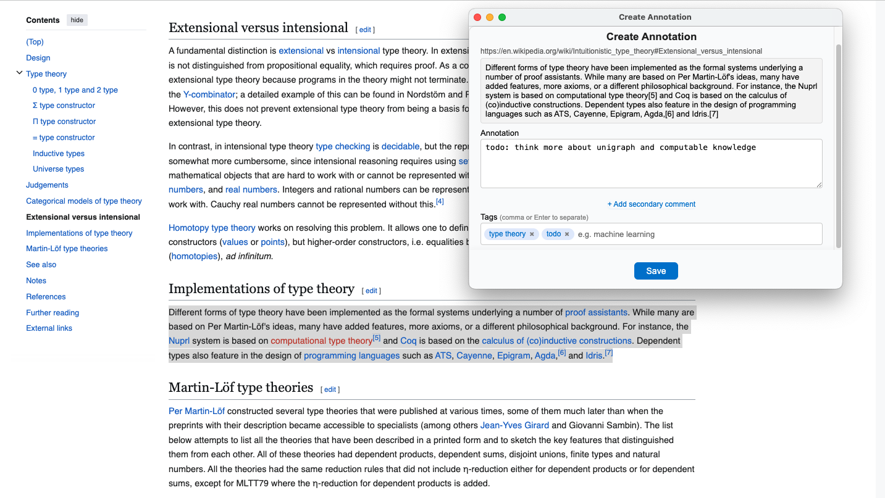

## Unigraph Chrome Extension

The Unigraph Chrome Extension lets you surf the web and annotate information into your personal Unigraph projects and knowledge graphs.
Once you save text, images, web pages, or other media into Unigraph, all of it's tools will be available to you.

**Documentation Site**: [https://aesgraph.github.io/unigraph/](https://aesgraph.github.io/unigraph/)<br>
**Live Demo**: [https://unigraph.vercel.app](https://unigraph.vercel.app)<br>
**Repository**: [https://github.com/aesgraph/unigraph](https://github.com/aesgraph/unigraph)<br>

⚠️ This chrome extension is still under development and not registered.




<br>
<br>

#### Build & Development Instructions

##### 1. Environment Variables

Create a `.env` file in the project root with the following content:

```
SUPABASE_URL=your_supabase_url
SUPABASE_ANON_KEY=your_supabase_anon_key
GOOGLE_CLIENT_ID=your_google_client_id (note this one is currently not used, its in manifest. see security notes below)
```

Replace the values with your actual Supabase project URL, anon key, and Google OAuth client ID. **Do not commit your `.env` file.**

##### 2. Build the Extension

From the project root, run:

```
npm run build
```

This will:

- Install dependencies in the `package/` directory (if needed)
- Compile TypeScript files in `package/`
- Inject your secrets from `.env` into the built files in `package/dist/` and into `package/manifest.json`

##### 3. Load the Extension in Chrome

- Go to `chrome://extensions`
- Click "Load unpacked"
- Select the `package/` directory

##### 4. Security Note

- The `package/dist/` directory is **not** committed to git (see `.gitignore`).
- Your secrets are only present in the built files after running the build script.
- Don't share your `.env` or built files with secrets publicly.
- Google Client ID and Chrome Extension Key are actually ok to be public. Preventing keys from being committed in manifest is possible, but not necessary in this case / for now.
